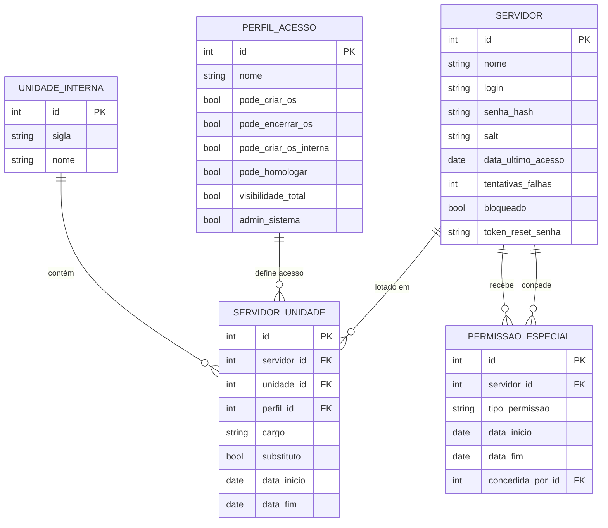
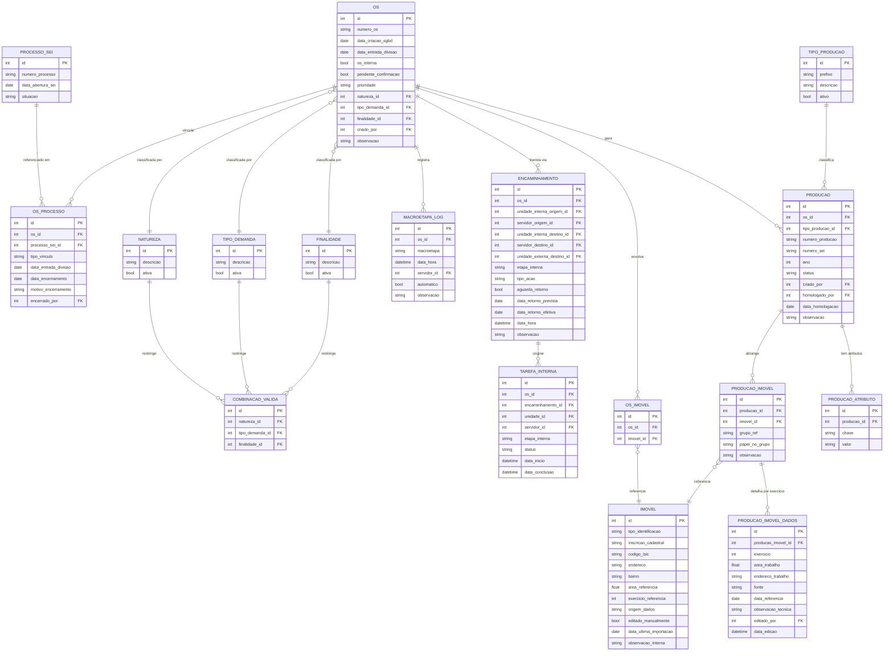

# Diagrama Entidade-Relacionamento — SGBD DAI

O diagrama está dividido em três blocos temáticos para facilitar a leitura.
O GitHub renderiza os blocos abaixo automaticamente.

---

## Bloco A — Estrutura organizacional e segurança

---

## Bloco B — OS, classificação, ciclo de vida, imóveis e produção

---

## Bloco C — Referências cruzadas, pesquisa e auditoria

```mermaid
erDiagram
  SERVIDOR {
    int id PK
    string nome
    string login
  }
  UNIDADE_INTERNA {
    int id PK
    string sigla
    string nome
  }
  UNIDADE_EXTERNA {
    int id PK
    string sigla
    string nome
    bool espera_retorno_padrao
    bool ativa
  }
  IMOVEL {
    int id PK
    string tipo_identificacao
    string inscricao_cadastral
    string codigo_isic
  }
  OS {
    int id PK
    string numero_os
    int criado_por FK
  }
  MACROETAPA_LOG {
    int id PK
    int os_id FK
    int servidor_id FK
    string macroetapa
    datetime data_hora
  }
  ENCAMINHAMENTO {
    int id PK
    int os_id FK
    int unidade_interna_origem_id FK
    int servidor_origem_id FK
    int unidade_interna_destino_id FK
    int servidor_destino_id FK
    int unidade_externa_destino_id FK
  }
  TAREFA_INTERNA {
    int id PK
    int os_id FK
    int unidade_id FK
    int servidor_id FK
    string etapa_interna
    string status
  }
  PRODUCAO {
    int id PK
    int os_id FK
    int criado_por FK
    int homologado_por FK
  }
  PRODUCAO_IMOVEL_DADOS {
    int id PK
    int producao_imovel_id FK
    int editado_por FK
    int exercicio
  }
  OS_PROCESSO {
    int id PK
    int os_id FK
    int encerrado_por FK
  }
  REGISTRO_PESQUISA {
    int id PK
    int servidor_id FK
    int imovel_id FK
    string numero_registro
    string tipo_fonte
    date data_registro
    date data_encaminhamento
    string tipo_pesquisa
    int semana_referencia
    int mes_referencia
    int ano_referencia
    string observacao
  }
  META_PESQUISA {
    int id PK
    int servidor_id FK
    int unidade_id FK
    int criado_por FK
    string tipo_meta
    string tipo_pesquisa
    int mes
    int ano
    int quantidade_meta
  }
  LOG_AUDITORIA {
    int id PK
    int servidor_id FK
    string entidade
    int entidade_id
    string operacao
    string campo_alterado
    string valor_anterior
    string valor_novo
    datetime data_hora
    string justificativa
  }

  SERVIDOR         ||--o{ OS                    : "cria"
  SERVIDOR         ||--o{ MACROETAPA_LOG         : "registra"
  SERVIDOR         ||--o{ ENCAMINHAMENTO         : "origina"
  SERVIDOR         ||--o{ ENCAMINHAMENTO         : "recebe"
  SERVIDOR         ||--o{ TAREFA_INTERNA         : "executa"
  SERVIDOR         ||--o{ PRODUCAO               : "cria"
  SERVIDOR         ||--o{ PRODUCAO               : "homologa"
  SERVIDOR         ||--o{ PRODUCAO_IMOVEL_DADOS  : "edita"
  SERVIDOR         ||--o{ OS_PROCESSO            : "encerra"
  SERVIDOR         ||--o{ REGISTRO_PESQUISA      : "realiza"
  SERVIDOR         ||--o{ META_PESQUISA          : "tem meta"
  SERVIDOR         ||--o{ META_PESQUISA          : "cria meta"
  SERVIDOR         ||--o{ LOG_AUDITORIA          : "gera"
  UNIDADE_INTERNA  ||--o{ ENCAMINHAMENTO         : "origem"
  UNIDADE_INTERNA  ||--o{ ENCAMINHAMENTO         : "destino interno"
  UNIDADE_INTERNA  ||--o{ TAREFA_INTERNA         : "responsavel"
  UNIDADE_INTERNA  ||--o{ META_PESQUISA          : "meta coletiva"
  UNIDADE_EXTERNA  ||--o{ ENCAMINHAMENTO         : "destino externo"
  IMOVEL           ||--o{ REGISTRO_PESQUISA      : "objeto de pesquisa"
```

